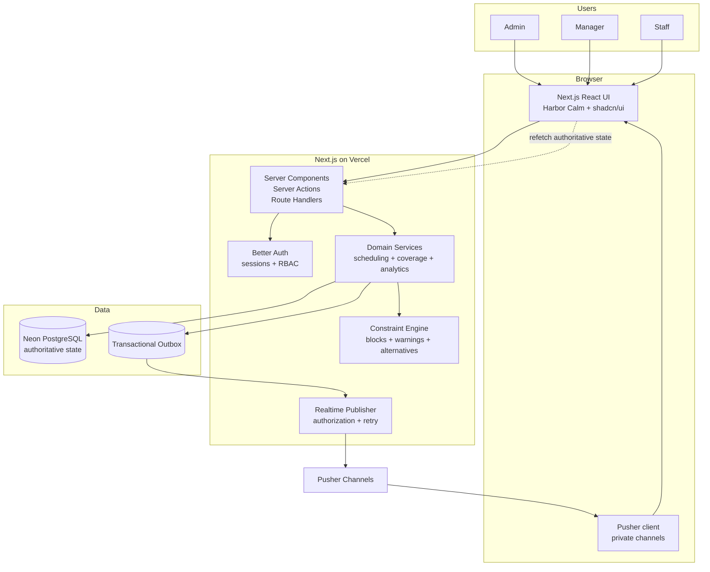
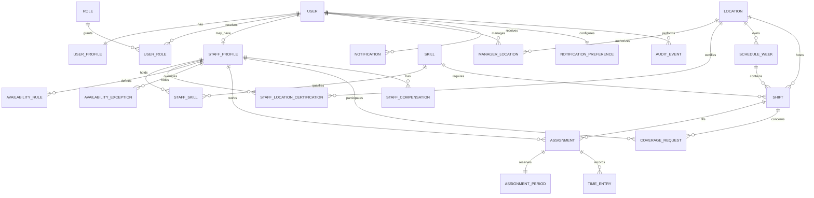

# ShiftSync

ShiftSync is a multi-location staff scheduling platform for **Coastal Eats**, a fictional restaurant group operating four locations across two time zones. It helps managers build safe, fair schedules while giving staff a clear way to manage availability, swaps, drops, and shift coverage.

> **Project status:** Slice 4 (Coverage Request State Machines) is complete. The system includes full swap/drop state machines (`createSwapRequest`, `acceptSwapRequest`, `claimDropRequest`, `approveSwapRequest`, `approveDropRequest`, `cancelCoverageRequest`), 3-request pending limits, 24-hour drop expiration, atomic shift edit invalidation, one-for-one headcount credit, role-based coverage queues, and 43 passing tests across 13 test files.

## Table of Contents

- [Project Overview](#project-overview)
- [Key Features](#key-features)
- [System Design](#system-design)
  - [Architecture](#architecture)
  - [Database Design](#database-design)
  - [Integrity and Concurrency](#integrity-and-concurrency)
- [Tech Stack](#tech-stack)
- [Installation and Setup](#installation-and-setup)
- [Available Scripts](#available-scripts)
- [Design Decisions and Assumptions](#design-decisions-and-assumptions)
- [Evaluation Scenarios](#evaluation-scenarios)
- [Current Limitations](#current-limitations)

## Project Overview

Coastal Eats currently lacks a shared view of staffing across its locations. That leads to uncovered call-outs, avoidable overtime, uneven distribution of desirable shifts, and conflicts when managers schedule the same employee independently.

ShiftSync creates one scheduling authority for three user groups:

- **Admins** oversee every location and can review or export audit history.
- **Managers** create and publish schedules for their assigned locations, evaluate staffing constraints, and approve coverage changes.
- **Staff** view published shifts, maintain availability, request swaps or drops, claim open coverage, and receive notifications.

The system favors correctness and explainability over automatic schedule generation. When an assignment cannot be made, the manager should see the exact rule that failed and qualified alternatives where possible.

## Key Features

- **Role-scoped access:** Admin, Manager, and Staff experiences with location-level authorization.
- **Multi-location scheduling:** Weekly draft and published schedules with location-specific cutoffs and time zones.
- **Explainable constraint enforcement:** Skill, certification, availability, overlap, minimum-rest, daily-hours, consecutive-day, and headcount checks.
- **Candidate and what-if guidance:** Qualified alternatives and projected labor impact before an assignment is committed.
- **Coverage workflows:** Shift swaps, drop requests, emergency replacements, approval states, expiry, and cancellation.
- **Overtime and fairness analytics:** Weekly and daily hour warnings, projected overtime costs, desired-hours comparisons, and premium-shift distribution evidence.
- **Realtime operations:** Live schedule invalidation, persisted notifications, concurrent-assignment conflict feedback, and an on-duty dashboard.
- **Timezone-safe scheduling:** UTC scheduling authority with IANA time zones for location display, availability, DST, and overnight shifts.
- **Auditable changes:** Append-only before/after records for material schedule and coverage mutations.

## System Design

ShiftSync uses a modular monolith: one Next.js application owns the role-aware interface, authenticated server entry points, scheduling domain services, integrations, and database access. PostgreSQL is the source of truth; Pusher distributes hints that prompt clients to refetch committed state.

### Architecture



Scheduling rules do not live in React components or transport handlers. Server Actions and Route Handlers delegate to shared domain services so previews and final mutations use the same rules.

### Database Design

The conceptual entity model separates identity, qualification, availability, staffing demand, assignment state, workflow state, and history.



Better Auth additionally owns its `session`, `account`, and `verification` tables. They are omitted from the conceptual ERD to keep the scheduling relationships readable.

| Domain | Tables | Purpose |
| --- | --- | --- |
| Identity and access | `user`, `session`, `account`, `verification`, `user_profiles`, `roles`, `user_roles`, `staff_profiles` | Authentication, profiles, and application roles |
| Locations and qualifications | `locations`, `manager_locations`, `skills`, `staff_skills`, `staff_location_certifications` | Management scope and time-bounded staff eligibility |
| Availability | `availability_rules`, `availability_exceptions` | Recurring local-time windows and date-specific overrides |
| Scheduling | `schedule_weeks`, `shifts`, `assignments`, `assignment_periods` | Publication state, staffing demand, and authoritative assignments |
| Labor and fairness | `staff_compensation` plus assignment-derived projections | Overtime cost, desired hours, and premium-shift evidence |
| Coverage | `coverage_requests` | Swap and drop state machines |
| Operations | `time_entries` | Manual clock-in/out and live on-duty state |
| Communication | `notifications`, `notification_preferences`, `outbox_events` | Durable notifications and reliable realtime publication |
| Audit | `audit_events` | Append-only before/after history and admin export |

User identities generated by Better Auth use `text` keys. Scheduling entities such as locations, shifts, assignments, and requests use UUIDs.

### Integrity and Concurrency

The browser can preview a scheduling decision, but every mutation is revalidated inside a PostgreSQL transaction.

The assignment transaction:

1. Locks the shift and affected staff scheduling rows in a deterministic order.
2. Reloads current assignments and authorization state.
3. Validates qualification, availability, overlap, rest, headcount, and labor rules.
4. Commits the assignment, audit event, notification, and outbox event atomically.
5. Publishes the committed event through Pusher after the transaction succeeds.

Important database guarantees include:

- A PostgreSQL range exclusion constraint prevents overlapping active assignments for the same staff member.
- Shift-row locking prevents concurrent users from taking the same final headcount slot.
- A unique location/week pair provides one publication authority per schedule week.
- UTC instants are authoritative for overlap, duration, and rest calculations; IANA time zones preserve local intent and DST behavior.
- Only one open time entry is allowed per assignment and staff member.
- Audit records preserve historical truth even when current assignments, qualifications, or shifts change.
- Realtime events are advisory; reconnecting clients refetch authoritative PostgreSQL state.

## Tech Stack

| Concern | Technology |
| --- | --- |
| Application | Next.js 16, React 19, TypeScript |
| UI | Tailwind CSS 4, shadcn/ui, Base UI, Lucide |
| Design direction | Harbor Calm design system |
| Authentication | Better Auth with database sessions |
| Database | Neon Serverless PostgreSQL |
| Query and migrations | Drizzle ORM and Drizzle Kit |
| Validation and forms | Zod, React Hook Form |
| Realtime | Pusher Channels |
| Testing | Vitest, Testing Library, Playwright |
| Deployment target | Vercel |

## Installation and Setup

### Prerequisites

- Node.js 20.9 or newer
- pnpm 11
- A Neon PostgreSQL database
- A Pusher Channels application

### 1. Clone and install

```bash
git clone https://github.com/mbeka02/ShiftSync.git
cd ShiftSync
corepack enable
pnpm install
```

### 2. Configure the environment

```bash
cp .env.example .env.local
```

Populate the following variables in `.env.local`:

| Variable | Visibility | Purpose |
| --- | --- | --- |
| `DATABASE_URL` | Server only | Pooled Neon connection for application queries |
| `DATABASE_URL_UNPOOLED` | Server only | Direct Neon connection for migrations and administrative work |
| `BETTER_AUTH_SECRET` | Server only | Better Auth signing secret |
| `BETTER_AUTH_URL` | Server only | Application origin, such as `http://localhost:3000` |
| `PUSHER_APP_ID` | Server only | Pusher application identifier |
| `PUSHER_SECRET` | Server only | Pusher signing secret |
| `NEXT_PUBLIC_PUSHER_APP_KEY` | Public | Pusher browser application key, also reused by the server publisher |
| `NEXT_PUBLIC_PUSHER_CLUSTER` | Public | Pusher cluster used by browser and server clients |

Never commit `.env.local`. Values prefixed with `NEXT_PUBLIC_` are included in browser code and must not contain secrets.

### 3. Seed demo accounts and data

```bash
pnpm db:push
pnpm db:seed
```

This populates the database with the initial location (`Harbor East`), schedule week, skill fixtures, and three role-specific demo accounts:

| Role | Email | Password | Scope |
| --- | --- | --- | --- |
| **Admin** | `admin@shiftsync.local` | `ShiftSyncDemo!2026` | Cross-location oversight and scheduling workspace |
| **Manager** | `manager@shiftsync.local` | `ShiftSyncDemo!2026` | Assigned location (`Harbor East`) schedule board |
| **Staff** | `staff@shiftsync.local` | `ShiftSyncDemo!2026` | Own published shifts and timezone-aware agenda |

### 4. Start the application

```bash
pnpm dev
```

Open [http://localhost:3000](http://localhost:3000) to log in.

## Available Scripts

| Command | Purpose |
| --- | --- |
| `pnpm dev` | Start the local Next.js development server |
| `pnpm build` | Create a production build |
| `pnpm start` | Run the production build |
| `pnpm lint` | Run ESLint |
| `pnpm test` | Run Vitest in watch mode |
| `pnpm test:run` | Run the Vitest suite once |
| `pnpm test:coverage` | Run Vitest with coverage |
| `pnpm db:seed` | Seed database with demo accounts and initial schedule week |
| `pnpm db:generate` | Generate Drizzle migrations from the schema |
| `pnpm db:migrate` | Apply generated migrations |
| `pnpm db:push` | Push schema changes during development |
| `pnpm db:studio` | Open Drizzle Studio |

The current spike tests call real Neon and Pusher services and therefore require valid local environment credentials.

## Design Decisions and Assumptions

The challenge deliberately leaves several behaviors open. ShiftSync adopts the following explicit rules:

| Ambiguity | Decision | Reason |
| --- | --- | --- |
| Staff member is de-certified from a location | Preserve assignments and audit history. Block new assignments outside the certification window and flag affected future assignments as at risk. | Historical payroll, fairness, and audit evidence must remain stable. |
| Desired hours conflict with availability | Availability is a hard constraint; desired hours are a soft planning and fairness target. | A preference must never override an employee's declared availability. |
| Short shifts and consecutive days | Any day with at least one active shift counts as one worked day, regardless of shift duration. | This is deterministic and aligns with a day-count rule. |
| Shift changes after an approved swap | Approval immediately makes the replacement assignment authoritative. A later material edit must revalidate the current assignee and is rejected if it creates an invalid schedule. | Approved work is not silently undone, and managers cannot edit around constraints. |
| Location spans a timezone boundary | Each scheduling location has exactly one IANA timezone. A genuinely split location is represented as two logical scheduling locations. | Scheduling, payroll boundaries, availability, and calendar display require one local clock. |

Additional operating rules:

- Schedule and reporting weeks run from Monday 00:00 to the following Monday 00:00 in the employee's primary timezone.
- Daily hours and consecutive days use the employee's primary timezone; shift display uses the location timezone.
- A shift must fit completely inside an available interval. A one-off exception replaces the recurring rule for that local date.
- An overnight shift remains one shift and is not split at midnight.
- Friday and Saturday shifts starting at or after 17:00 in the location timezone are classified as premium when created.
- The sixth consecutive day produces a warning. A seventh day requires a manager override with a documented reason.
- The original assignment remains active throughout a pending swap or drop and changes only when manager approval commits.
- Notifications are persisted in PostgreSQL. Email is simulated, and Pusher delivery is best-effort rather than authoritative.
- On-duty state uses manual in-app time entries; external time clocks, geofencing, and payroll integrations are outside the assessment scope.

## Evaluation Scenarios

| Scenario | ShiftSync response |
| --- | --- |
| Sunday Night Chaos | **Find Coverage** surfaces qualified, available replacements and supports an audited emergency assignment inside the normal edit cutoff. |
| Overtime Trap | Candidate preview shows weekly hours and projected overtime cost before confirmation and identifies the assignment crossing the threshold. |
| Timezone Tangle | Shift instants are converted into the timezone stored on the staff member's availability rule rather than treating `09:00–17:00` as local to every location. |
| Simultaneous Assignment | PostgreSQL locks and overlap constraints serialize competing assignments; one succeeds and the other receives an explainable conflict. |
| Fairness Complaint | The report compares premium-shift opportunities with actual allocation and exposes the underlying shift evidence. |
| Regret Swap | The requester may cancel before manager approval; the original assignment remains unchanged until an approval transaction commits. |

## Current Limitations

- Slices 1, 2, 3, and 4 deliver core identity, RBAC authorization, location-scoped manager boards, published-schedule staff reads, a pure constraint engine (`evaluateAssignment`), PostgreSQL row-level locked transactions (`assignStaff`), schedule week publication/unpublishing with cutoff enforcement, audited emergency coverage (`assignEmergencyCoverage`), non-destructive availability risk flagging (`AT_RISK_AVAILABILITY`), persisted notification center, transactional outbox event insertion, and coverage request state machines (`createSwapRequest`, `acceptSwapRequest`, `claimDropRequest`, `approveSwapRequest`, `approveDropRequest`, `cancelCoverageRequest`).
- Pusher private-channel authorization and live browser invalidation are scheduled for Slice 5.
- Automatic schedule generation is intentionally out of scope. ShiftSync assists human scheduling with constraints, alternatives, and evidence.
- Email delivery is simulated, and external payroll, hardware clock, and geofencing integrations are out of scope.
