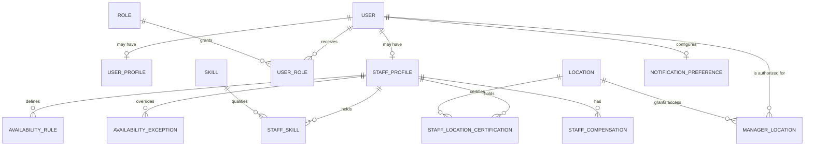
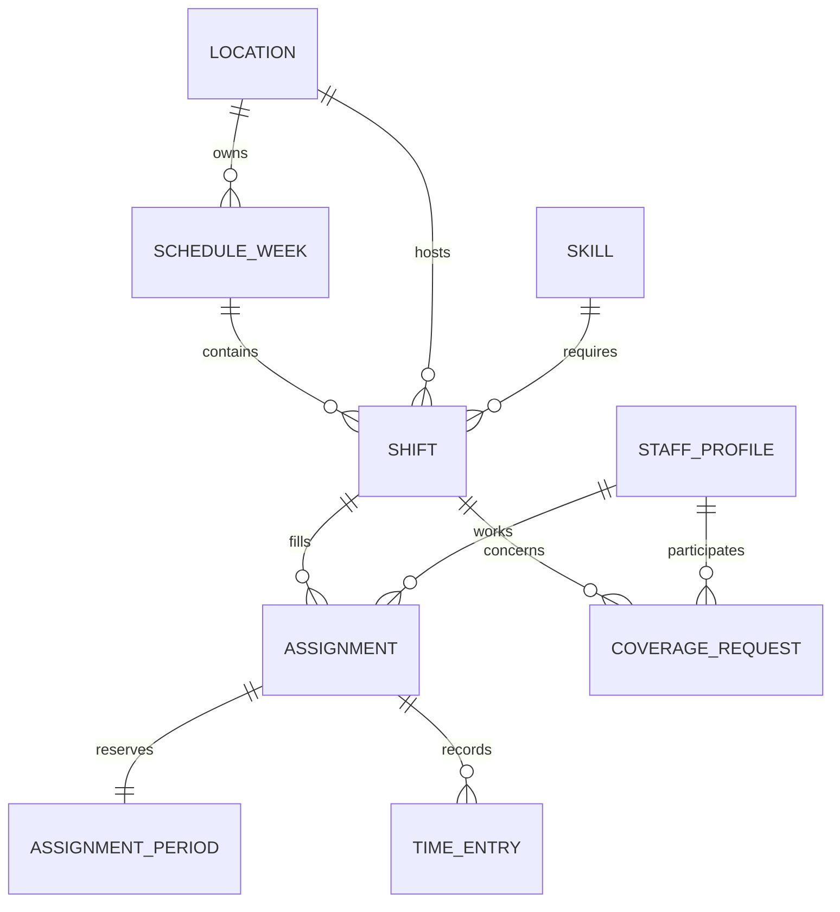
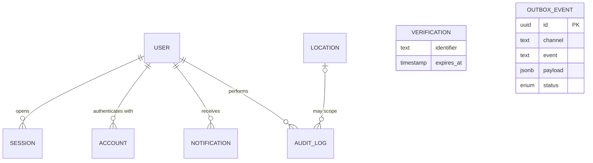

# ShiftSync

ShiftSync is a multi-location staff scheduling platform for **Coastal Eats**, a fictional restaurant group operating four locations across Eastern and Pacific time. It helps managers build safe, explainable schedules while giving staff a clear path through coverage, notifications, and on-duty work.

The project follows one central rule: PostgreSQL owns the truth. Every important mutation is authorized and revalidated in a transaction; realtime events tell clients when to refetch that committed state.

**[Open the live demo](https://shift-sync-theta.vercel.app)** · [View the source](https://github.com/mbeka02/ShiftSync)

## Table of Contents

- [Project Overview](#project-overview)
- [Key Features](#key-features)
- [Demo Accounts](#demo-accounts)
- [System Design](#system-design)
  - [Architecture](#architecture)
  - [Database Design](#database-design)
  - [Data Model and Schema Constraints](#data-model-and-schema-constraints)
- [Tech Stack](#tech-stack)
- [Installation and Setup](#installation-and-setup)
  - [Neon Branch Isolation](#neon-branch-isolation)
  - [Production Deployment](#production-deployment)
- [Available Scripts](#available-scripts)
- [Implementation and Testing Strategy](#implementation-and-testing-strategy)
- [Design Decisions and Assumptions](#design-decisions-and-assumptions)
- [Evaluation Scenarios](#evaluation-scenarios)
- [Known Limitations](#known-limitations)

## Project Overview

Coastal Eats needs one reliable view of staffing across locations. Without it, call-outs go uncovered, overtime is discovered too late, premium shifts feel unfair, and separate managers can unknowingly compete for the same employee.

ShiftSync serves three roles:

- **Admins** have cross-location oversight, analytics, and audit export access.
- **Managers** manage their assigned locations, create and publish schedules, evaluate candidates, approve or reject coverage requests, and monitor on-duty staff.
- **Staff** see their published schedule, clock in and out, request swaps or drops, claim eligible coverage, and receive persisted notifications.

The system assists human schedulers rather than generating schedules automatically. Candidate previews expose the specific blockers, warnings, projected hours, and qualified alternatives behind each decision.

## Key Features

- **Role- and location-scoped access** backed by Better Auth database sessions and server-side authorization.
- **Multi-location weekly schedules** with manager location switching, week navigation, draft/published states, and a configurable edit cutoff.
- **Explainable assignment checks** for skills, certification, availability, overlap, 10-hour rest, headcount, daily hours, weekly hours, and consecutive days.
- **What-if candidate review** showing projected daily/weekly hours, overtime, work streaks, blockers, and warnings before commit.
- **Manager shift controls** for timezone-safe creation and material edits, including audited seventh-day overrides and emergency coverage.
- **Coverage state machines** for targeted swaps and open drops, with acceptance/claim, manager approval or rejection, cancellation, expiry, pending limits, and shift-edit invalidation.
- **Overtime and fairness analytics** with threshold-causing assignment evidence, projected overtime premium, desired-hours deltas, and opportunity-normalized premium-shift allocation.
- **Realtime operational updates** through authorized Pusher channels, transactional outbox retry, event deduplication, focus/reconnect refresh, and a 25-second visible-tab polling fallback.
- **On-duty state** with one-open-entry enforcement, staff clock-in/out controls, and a live location dashboard.
- **Persisted communication and audit evidence** with read/unread notifications, delivery preferences, append-only audit records, and role-scoped CSV export.
- **Timezone-safe storage** using UTC instants as scheduling authority plus IANA timezone and local wall-clock snapshots for display and DST review.

## Demo Accounts

The deterministic seed creates four locations, two managers, twenty staff members, two schedule weeks per location, and fixtures for overtime, fairness, emergency coverage, coverage approval, on-duty state, historical certification, and concurrency.

All demo accounts use the password **`ShiftSyncDemo!2026`**.

| Role / scenario | Email | Useful scope |
| --- | --- | --- |
| Admin | `admin@shiftsync.local` | All four locations, analytics, and audit export |
| East manager | `manager.east@shiftsync.local` | Harbor East and Midtown Table |
| West manager | `manager.west@shiftsync.local` | Pacific Pier and Sunset Kitchen |
| Staff — Maria Chen | `maria@shiftsync.local` | Published shifts and seeded drop workflow |
| Staff — Jordan Lee | `coverage@shiftsync.local` | Coverage claim/acceptance workflow |
| Staff — Casey Wright | `casey@shiftsync.local` | Accepted swap and Regret Swap workflow |

The same credentials are intended for the public evaluation deployment. A guarded daily refresh keeps the production demo's current and following schedule weeks aligned with the calendar without recreating identities or historical records. The logins remain stable, but changes made to those rolling scenario weeks may be replaced by the next refresh.

To restore deterministic passwords and fixtures locally, rerun the guarded development seed or rebuild command described below; both replace current development demo data.

## System Design

ShiftSync is a modular monolith. One Next.js application owns the Harbor Calm interface, authenticated entry points, domain services, persistence, and integration adapters. This keeps scheduling rules independent of React and ensures browser actions and tests exercise the same services.

### Architecture

```mermaid
flowchart LR
    People["Admins · Managers · Staff"]
    UI["Role-aware<br/>Next.js UI"]
    Entry["Server Components<br/>Actions · Route Handlers<br/>Better Auth + RBAC"]
    Domain["Domain services<br/>Shared constraint engine"]
    Neon[("Neon PostgreSQL<br/>authoritative state")]
    Delivery["Outbox drain"]
    Pusher["Pusher<br/>private channels"]
    Refresh["Client invalidation<br/>+ authoritative refetch"]
    Cron["Vercel Cron"]
    Demo["Rolling demo refresh"]

    People --> UI
    UI -->|"authenticated request"| Entry
    Entry --> Domain
    Domain -->|"domain + evidence + outbox transaction"| Neon
    Neon -->|"committed pending events"| Delivery
    Delivery --> Pusher
    Pusher --> Refresh
    Cron -->|"daily"| Demo
    Demo -->|"replace rolling fixtures"| Neon

    classDef actor fill:#FFF4D6,stroke:#8A5A00,stroke-width:2px,color:#2B2118
    classDef client fill:#E5F3F1,stroke:#176B68,stroke-width:2px,color:#123B3A
    classDef application fill:#DCECEF,stroke:#164C5A,stroke-width:2px,color:#102F38
    classDef data fill:#E8E2F2,stroke:#594778,stroke-width:2px,color:#2B2340
    classDef external fill:#F4E7E2,stroke:#8A4B3A,stroke-width:2px,color:#41231C

    class People actor
    class UI,Refresh client
    class Entry,Domain,Delivery,Demo application
    class Neon data
    class Pusher,Cron external
```



[View the architecture Mermaid source](docs/diagrams/readme_01_flowchart_architecture.mmd).

The deployment selects exactly one Neon branch through its connection URLs. Production, development, and test therefore share a schema but never a live request path or dataset. Pusher messages are invalidation hints, not alternate state: reconnect, focus, and visible-tab polling all refetch committed PostgreSQL state.

### Database Design

The data model is shown in three bounded-context views so the relationships remain legible on GitHub.

#### Identity, access, and eligibility



[View the identity and eligibility ERD Mermaid source](docs/diagrams/readme_02_er_identity_eligibility.mmd).

#### Scheduling, coverage, and on-duty state



[View the scheduling and operations ERD Mermaid source](docs/diagrams/readme_03_er_scheduling_operations.mmd).

#### Authentication, communication, and evidence



[View the evidence and delivery ERD Mermaid source](docs/diagrams/readme_04_er_evidence_delivery.mmd).

`verification` is keyed by its Better Auth identifier rather than a user foreign key. `outbox_events` deliberately carries channel/event/payload data instead of a domain foreign key so one delivery mechanism can serve every aggregate.

| Domain | Tables | Responsibility |
| --- | --- | --- |
| Identity and access | `user`, `session`, `account`, `verification`, `user_profiles`, `roles`, `user_roles`, `staff_profiles` | Authentication, user details, and application roles |
| Locations and eligibility | `locations`, `manager_locations`, `skills`, `staff_skills`, `staff_location_certifications` | Manager scope and time-bounded staff qualification |
| Availability | `availability_rules`, `availability_exceptions` | Recurring local-time windows and date-specific overrides |
| Scheduling | `schedule_weeks`, `shifts`, `assignments`, `assignment_periods` | Publication, staffing demand, active assignments, and overlap protection |
| Coverage | `coverage_requests` | Swap/drop participants, state, expiry, cancellation, and approval |
| Labor and operations | `staff_compensation`, `time_entries` | Overtime projection and open/closed on-duty entries |
| Communication | `notifications`, `notification_preferences`, `outbox_events` | Durable user communication and reliable realtime delivery |
| Evidence | `audit_logs` | Actor, location scope, reason, and before/after state for material actions |

### Data Model and Schema Constraints

Better Auth identity keys are `text`; application aggregates use UUID primary keys. Foreign keys preserve the ownership paths shown above, while date-effective join tables retain historical eligibility instead of overwriting it.

| Area | Key constraints and guarantees |
| --- | --- |
| Identity and RBAC | `user_profiles` and `staff_profiles` use the Better Auth `user.id` as both primary and foreign key. `roles.code` is unique and checked to `admin`, `manager`, or `staff`; `user_roles` has a composite primary key. |
| Manager and staff eligibility | `manager_locations`, `staff_skills`, and `staff_location_certifications` use composite keys that include `valid_from`. Check constraints reject an end date before its start date, preserving time-bounded history. |
| Availability | Recurring rules store local wall-clock times, IANA timezone, and effective dates; weekday is checked to `1–7`. Date-specific exceptions are indexed by staff and date. |
| Schedule weeks and shifts | `schedule_weeks` uniquely constrains `(location_id, week_start_date)`. Shift checks require `ends_at > starts_at` and `headcount >= 1`; UTC instants are authoritative while local snapshots preserve location-facing display and DST review. |
| Assignments | A partial unique index permits only one active `(shift_id, staff_id)` assignment. A manager override cannot be stored without a reason. `assignment_periods` adds a GiST exclusion constraint on `(staff_id, work_period)` so overlapping active work is rejected across every location. |
| Coverage | An enum limits lifecycle states, and a participant check distinguishes targeted swaps from open drops. Expiry, the three-pending-request limit, and legal state transitions depend on locked current state and are enforced inside service transactions. |
| On-duty entries | Partial unique indexes allow at most one open time entry for an assignment and at most one open time entry for a staff member. |
| Compensation and preferences | Effective-dated compensation rows reject negative rates, multipliers below `1`, and reversed date ranges. Notification mode is constrained to `in_app_only` or `in_app_and_email`. |
| Evidence and delivery | Audit records store actor, optional location scope, reason, request correlation, and JSON before/after state. They are append-only by service contract. Outbox status and creation indexes support ordered, retryable delivery. |

Every mutation treats a browser preview as advisory and checks current database state again before committing. Assignment transactions lock shift then staff, rerun authorization and constraints, and let the exclusion constraint provide a final storage-level guard. Coverage approval locks shift → request → affected staff in deterministic order. Outbox workers claim rows with `SELECT ... FOR UPDATE SKIP LOCKED`, preventing concurrent drains from delivering the same pending row. Domain state, audit records, notifications, and outbox events commit together, so a failed transaction leaves no partial side effects.

## Tech Stack

| Concern | Technology |
| --- | --- |
| Application | Next.js 16, React 19, TypeScript |
| UI | Tailwind CSS 4, shadcn/ui, Base UI, Lucide, Sonner |
| Design | Harbor Calm design system |
| Authentication | Better Auth with database sessions |
| Database | Neon Serverless PostgreSQL |
| Data access and migrations | Drizzle ORM and Drizzle Kit |
| Validation and forms | Zod and React Hook Form |
| Realtime | Pusher Channels plus visible-tab polling fallback |
| Testing | Vitest, Testing Library, and Playwright |
| Deployment | Vercel |

## Installation and Setup

### Prerequisites

- Node.js 20.9 or newer
- pnpm 11
- A Neon project with separate `development` and `test` branches
- A Pusher Channels application

### 1. Clone and install

```bash
git clone https://github.com/mbeka02/ShiftSync.git
cd ShiftSync
corepack enable
pnpm install
```

### 2. Configure development and test environments

```bash
cp .env.example .env.local
cp .env.test.example .env.test.local
```

Populate `.env.local` with development-branch credentials and `.env.test.local` with test-branch credentials.

| Variable | File / visibility | Purpose |
| --- | --- | --- |
| `DATABASE_URL` | Server only | Pooled Neon URL for runtime queries |
| `DATABASE_URL_UNPOOLED` | Server only | Direct Neon URL for migrations and administrative work |
| `NEON_BRANCH` | Server-only safety label | Must be `development`, `test`, or `production` for the matching environment file |
| `BETTER_AUTH_SECRET` | Server only | Better Auth signing secret; generate with `openssl rand -base64 32` |
| `BETTER_AUTH_URL` | Server only | Application origin, such as `http://localhost:3000` |
| `PUSHER_APP_ID` | Server only | Pusher application ID |
| `PUSHER_SECRET` | Server only | Pusher signing secret |
| `NEXT_PUBLIC_PUSHER_APP_KEY` | Public | Pusher application key used by browser and server clients |
| `NEXT_PUBLIC_PUSHER_CLUSTER` | Public | Pusher application cluster |
| `OUTBOX_DRAIN_SECRET` | Server only | Bearer secret for the bounded internal retry endpoint |
| `CRON_SECRET` | Server only | Bearer secret automatically sent by Vercel to the rolling demo refresh route |
| `DEMO_REFRESH_ENABLED` | Server-only feature flag | Set to `true` only for the public production demo |

The connection URL selects the actual Neon branch; `NEON_BRANCH` is a fail-closed label used by destructive scripts and tests. Never place a Pusher secret, database URL, or auth secret in a `NEXT_PUBLIC_` variable.

### 3. Build the local development database

```bash
pnpm db:rebuild:development
```

This command **deletes and recreates the schemas on the configured development branch**, applies committed Drizzle migrations, and loads deterministic demo data. It refuses to run unless `.env.local` declares `NEON_BRANCH=development`.

For an existing database whose data should be preserved, use `pnpm db:migrate` instead. Running `pnpm db:seed` directly also replaces demo data and is guarded to development by default.

### 4. Verify and run

```bash
pnpm db:verify-isolation
pnpm db:verify-demo
pnpm dev
```

Open [http://localhost:3000](http://localhost:3000) and use one of the demo accounts above.

### Neon Branch Isolation

The project uses three long-lived Neon branches:

| Neon branch | Local environment | Use |
| --- | --- | --- |
| `development` | `.env.local` | Local app, manual review, and Playwright fixtures |
| `test` | `.env.test.local` | Vitest integration tests only |
| `production` | Vercel variables; optional ignored `.env.production.local` for controlled bootstrap | Public evaluator deployment |

`pnpm test:run` loads `.env.test.local` and fails before collection unless `NEON_BRANCH=test`. The isolation verifier writes a temporary marker to `test`, proves it is absent from `development`, and removes it afterward.

`pnpm test:e2e:reset` is intentionally different: it rebuilds **development** before running the real browser scenarios, so do not use it while preserving manual changes on that branch.

### Production Deployment

Configure Vercel with the pooled and direct URLs for the Neon `production` branch, set `NEON_BRANCH=production`, and provide the production Better Auth, Pusher, and outbox secrets. Changing `NEON_BRANCH` alone does not switch databases—the two Neon URLs must also target production.

The included Vercel Cron runs once daily at `10:00 UTC`, which fits the Hobby plan's daily-job limit. With `DEMO_REFRESH_ENABLED=true` and `CRON_SECRET` configured, it closes stale on-duty entries, expires stale coverage, and rebuilds only the current and following demo schedule weeks. It does not recreate accounts, roles, locations, skills, or historical schedule data.

Production bootstrap is a deliberately destructive, one-time operation:

```bash
ALLOW_PRODUCTION_BOOTSTRAP=I_UNDERSTAND_THIS_RESETS_PRODUCTION pnpm db:bootstrap:production
```

The command requires an ignored `.env.production.local`, drops both application and Drizzle migration schemas, reapplies migrations, and loads the public demo accounts. Do not run it against a production database containing user data. Normal releases should apply migrations without reseeding.

## Available Scripts

| Command | Purpose |
| --- | --- |
| `pnpm dev` | Start the local Next.js development server |
| `pnpm build` | Create a production build |
| `pnpm start` | Run the production build |
| `pnpm lint` | Run ESLint |
| `pnpm test` | Run Vitest in watch mode using the guarded test environment |
| `pnpm test:run [files…]` | Migrate the test branch and run the Vitest suite once |
| `pnpm test:coverage` | Run Vitest with coverage |
| `pnpm test:e2e` | Run Playwright against the current development data |
| `pnpm test:e2e:reset` | Destructively rebuild development, then run all evaluator browser scenarios |
| `pnpm db:generate` | Generate a Drizzle migration from schema changes |
| `pnpm db:migrate` | Apply migrations using the selected local environment |
| `pnpm db:migrate:test` | Apply migrations to the isolated test branch |
| `pnpm db:push` | Push schema changes directly; intended only for deliberate development use |
| `pnpm db:seed` | Replace deterministic demo data on an authorized branch |
| `pnpm db:rebuild:development` | Reset, migrate, and seed the development branch |
| `pnpm db:bootstrap:production` | Guarded destructive production reset, migration, and demo seed |
| `pnpm db:refresh-demo` | Rebuild rolling schedule fixtures on development without replacing identities |
| `pnpm db:refresh-demo:production` | Guarded manual refresh of rolling production fixtures |
| `pnpm db:test:reset` | Reset the isolated test schemas |
| `pnpm db:verify-isolation` | Prove test writes are not visible in development |
| `pnpm db:verify-demo` | Verify four locations, twenty staff, and documented logins |
| `pnpm db:studio` | Open Drizzle Studio |

The integration and browser suites use real Neon transactions. Runtime depends on database region, compute wake-up, and network latency.

## Implementation and Testing Strategy

### Domain service boundaries

React and Next.js entry points are delivery layers, not owners of scheduling rules. Server Components load authorized read models; Server Actions and Route Handlers validate untrusted input and call focused TypeScript services under `server/`. Scheduling, coverage, reports, audit, preferences, on-duty state, and realtime delivery therefore expose reusable seams that the UI and tests exercise directly. The pure constraint engine is shared by candidate previews and transactional assignment, preventing a second implementation of the rules in the interface.

### Test-driven development

The project was delivered in vertical slices using Red → Green → Review/Refactor. Each complex behavior first received a public seam and a failing test, then the smallest maintainable implementation. This was especially important for scheduling constraints, coverage request state transitions, cutoff/emergency behavior, overtime evidence, fairness calculations, outbox delivery, and race outcomes. Internal domain collaborators are not mocked; only external delivery boundaries are substituted where isolation is necessary.

### Verification hierarchy

1. **Pure Vitest checks** exercise deterministic constraint calculations and time handling.
2. **Transactional integration tests** run against the isolated Neon `test` branch with real migrations, foreign keys, row locks, exclusion constraints, rollback, RBAC, and audit/outbox atomicity.
3. **Static gates** run `pnpm exec tsc --noEmit` and `pnpm lint` before a production build.
4. **Playwright evaluator flows** rebuild deterministic development data and walk the six named challenge scenarios through authenticated browser sessions.
5. **Live adapter smoke tests** verify the Neon WebSocket transaction path and Pusher transport/private-channel boundary.

The suites are intentionally separated by Neon branch: normal development uses `development`, integration tests use `test`, and Vercel uses `production`. Guard scripts fail closed when a command and branch label do not match.

## Design Decisions and Assumptions

The challenge deliberately leaves five behaviors unspecified. ShiftSync makes each decision explicit:

| Ambiguity | Decision | Reason |
| --- | --- | --- |
| Staff member is de-certified from a location | Preserve assignments and audit history. Block new assignments outside the certification window and flag affected future assignments as at risk. | Payroll, fairness, and historical evidence must not change when current eligibility changes. |
| Desired hours conflict with availability | Availability is a hard constraint; desired hours are a soft planning and fairness target. | A staffing preference must never override declared availability. |
| Short shifts and consecutive days | Any local calendar day containing an active shift counts as one worked day, whether the shift lasts one hour or eleven. | This is deterministic and matches a day-count rule rather than an hours proxy. |
| Shift changes after an approved swap | Approval makes the replacement assignment authoritative. A later material edit revalidates the current assignee and is rejected if it would create an invalid schedule. | An approved transfer is not silently undone, and managers cannot edit around constraints. |
| Location spans a timezone boundary | Each scheduling location has exactly one IANA timezone. A genuinely split site is modeled as two logical scheduling locations. | Availability, schedule display, payroll boundaries, and DST need one unambiguous local clock. |

Additional operating rules:

- Work weeks begin Monday at 00:00 in the employee’s primary timezone; schedule display uses the shift location timezone.
- A shift must fit entirely inside an availability interval. A one-off exception replaces the recurring rule for that local date.
- Overnight work remains one shift even when the local end date is the following day.
- Friday and Saturday evening shifts are premium opportunities when tagged by the manager or seed.
- Weekly hours warn at 35, overtime begins after 40, daily hours warn after 8, and daily hours above 12 are blocked.
- A sixth consecutive day warns. A seventh requires an authorized manager override with a stored reason.
- A drop expires 24 hours before its shift if still unclaimed; one staff member may have at most three pending coverage requests.
- The original assignment remains active through a pending swap/drop and changes only when approval commits.
- In-app notifications are authoritative and persisted. Email is simulated according to user preference.

## Evaluation Scenarios

The deterministic seed and `e2e/evaluator-scenarios.spec.ts` cover the challenge’s six named scenarios:

| Scenario | Demonstrated behavior |
| --- | --- |
| Sunday Night Chaos | A manager opens the emergency candidate workflow inside the cutoff, records a mandatory reason, assigns an eligible replacement, and produces audit/notification/outbox evidence. |
| Overtime Trap | Candidate preview exposes projected weekly hours and overtime before commit; analytics identify the threshold-causing assignment and projected premium. |
| Timezone Tangle | Switching between Eastern and Pacific locations changes the displayed IANA timezone while UTC instants remain authoritative. Availability is evaluated in the rule’s timezone. |
| Simultaneous Assignment | Two authenticated managers choose different eligible staff for the same final position. Transactional locking permits exactly one commit and returns an explainable rejection to the loser. |
| Fairness Complaint | Managers compare actual premium assignments against opportunity-normalized expectations and inspect the underlying eligible/assigned shift evidence. |
| Regret Swap | Staff can cancel after coworker acceptance but before approval; the original assignment remains authoritative. The seeded drop path also demonstrates claim and manager approval. |

## Known Limitations

- Automatic schedule generation is intentionally out of scope; ShiftSync supports human decisions with constraints, alternatives, and evidence.
- Email delivery is simulated. In-app notifications and their preferences are implemented, but no external email provider is configured.
- The outbox retry endpoint is implemented and protected, but production must attach a scheduler to call it.
- The public demo refresh replaces its rolling current/next-week fixtures once daily; evaluator changes to those weeks are not permanent.
- External payroll, hardware time clocks, geofencing, holiday calendars, and workforce-system integrations are out of scope.
- Demo identities are seed-driven; there is no admin-facing team provisioning interface yet.
- Availability persistence and at-risk reassessment exist in the domain layer, but a complete staff self-service availability editor is not included in the current UI.
- Audit evidence is exportable by authorized managers/admins, but a dedicated per-shift history screen is not included in the current UI.
